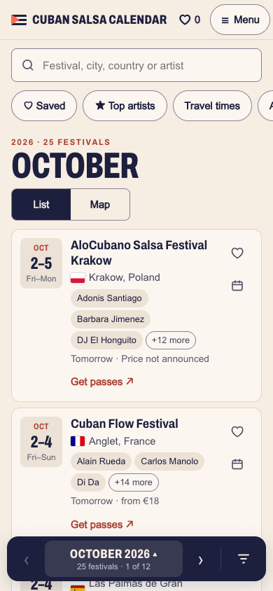
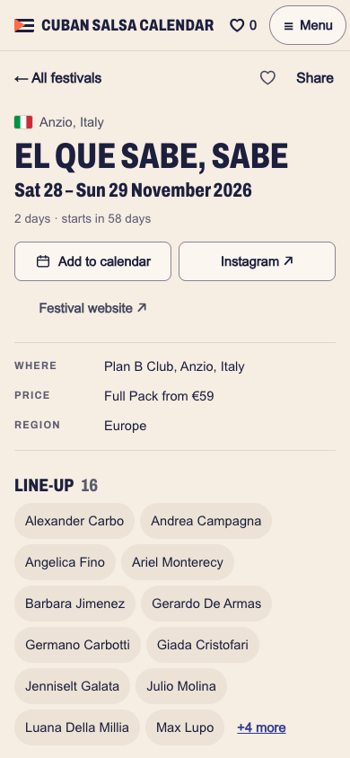
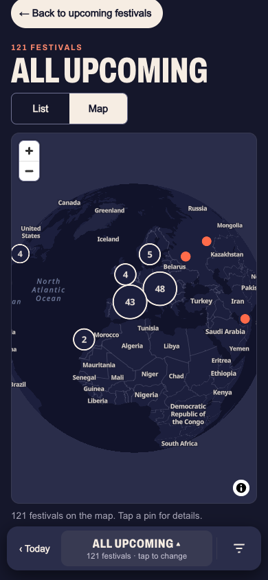

# Cuban Salsa Calendar

A worldwide calendar of Cuban salsa, timba and Afro-Cuban festivals, built for
dancers who plan trips on their phones, most of them arriving from an Instagram
link: **[cubansalsacalendar.com](https://cubansalsacalendar.com)**

<p>
  
  
  
</p>

## What it does

- **Browse by month** with a thumb-reachable dock, or see every upcoming festival,
  the archive, or a map.
- **Search** across festival names, cities, countries and artists, with suggestions,
  typo hints ("Did you mean Havana?") and accent-insensitive matching.
- **Filter** by date range, region or country, and sort by date or name. Filters live
  in the URL, so any view can be shared.
- **Festival pages** with dates, a countdown, venue, prices, official links, line-up,
  a map and other festivals the same month.
- **Save** festivals on the device and share the list with a link.
- **Add to calendar** (Google, Apple, Outlook) or subscribe to calendar feeds per region.
- **Top artists** ranking, and travel times from your city.
- **Submit a festival** or suggest a correction; submissions arrive as GitHub issues
  for review, nothing is published automatically.
- Light and dark mode, following the system or chosen by the visitor.

## Quality

The accessibility and Lighthouse checks run in CI on every push.

- **Lighthouse (mobile): 100** for accessibility, best practices and SEO on the
  month, list, festival and submit pages; performance 99–100 against the live site.
- **WCAG 2.1 AA:** axe finds no violations on any page, in light and dark mode, at
  phone and desktop widths, including open sheets, search suggestions, maps and
  form errors. Text meets 4.5:1 contrast, touch targets are 40–44 px, and
  everything works with a keyboard and a screen reader.
- **Fast on a phone over mobile data:** every page is pre-rendered HTML with about
  6 KB of inlined CSS. The interactive parts load only after the page
  has finished loading, so nothing competes with first paint. The heading font is cut to the weights and
  widths the design uses (24 KB), and the body font swaps in without moving text.
  The map library loads only when a map is on screen.
- **Unit tests** for date formatting, cards, filters, search, calendar files and
  artist names.

## How it's built

- **Static site from one data file.** `data/festivals.json` is the single source of
  truth, validated against a JSON Schema on every build. Astro pre-renders a page per
  month and per festival; Preact islands add search, filters, sheets and saving.
- **No database, no tracking.** Saved festivals, recent searches, theme and travel
  city stay in the visitor's browser.
- **Private fields stay private.** Editorial notes are stripped from the public
  bundle at build time and never rendered.
- **SEO and sharing:** schema.org `Event` data per festival, an Open Graph image
  generated at build for every festival, sitemap, and `.ics` files and feeds.
- **Edge functions for the rest.** A small Cloudflare Worker handles the forms
  (Turnstile spam check, per-IP rate limit, GitHub issue) and guards the data editor,
  verifying the Cloudflare Access login itself.
- **Editor for the owner:** `/admin` is a table-and-form editor with completeness
  checks, artist suggestions and JSON export.
- **Clean data:** artist spellings and couples are normalised from one registry, so
  the ranking counts each person once.
- **Maps:** MapLibre with OpenFreeMap vector tiles (OpenStreetMap data), restyled in
  the site palette, with a globe view and clustering.
- **Always current:** the site rebuilds daily, so finished festivals move to the archive.

| Layer | Choice |
|---|---|
| Framework | Astro 7, TypeScript, Preact islands |
| Hosting | Cloudflare Workers with static assets, Git-based deploys |
| Forms | Cloudflare Worker, Turnstile, GitHub Issues API |
| Maps | MapLibre GL, OpenFreeMap |
| Testing | Vitest, axe-core with Playwright, Lighthouse CI script |

## Running it locally

```bash
npm install
npm run dev        # http://localhost:4321
npm test           # unit tests
npm run check      # TypeScript, site and Worker
npm run build      # validates the data, then builds to dist/

# The Cloudflare runtime locally (headers, forms endpoint, admin gate):
cp .dev.vars.example .dev.vars
npm run build && npm run serve:cf    # http://localhost:8789
npm run check:a11y                   # axe on every page and state
npm run check:lighthouse             # Lighthouse, mobile
```

## Project structure

```
data/            festivals.json, its schema, the artist registry
src/pages/       routes: months, lists, festival pages, feeds, OG images, sitemap
src/components/  Preact islands and Astro layouts
src/lib/         pure logic: dates, cards, filters, search, calendar files, artists
src/styles/      design tokens and styles
worker/          Cloudflare Worker: forms endpoint and admin guard
scripts/         data validation, font subsetting, accessibility and Lighthouse checks
design/          design handoff: prototypes, decisions and screenshots
docs/            deployment runbook and screenshots
```

Deployment and day-to-day operation are described in [docs/DEPLOY.md](docs/DEPLOY.md).
